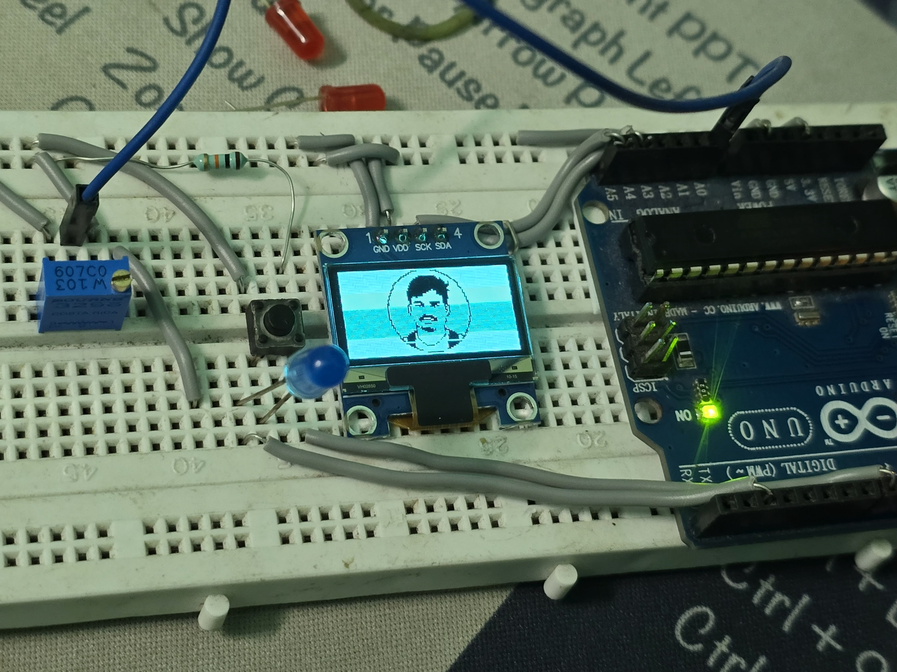
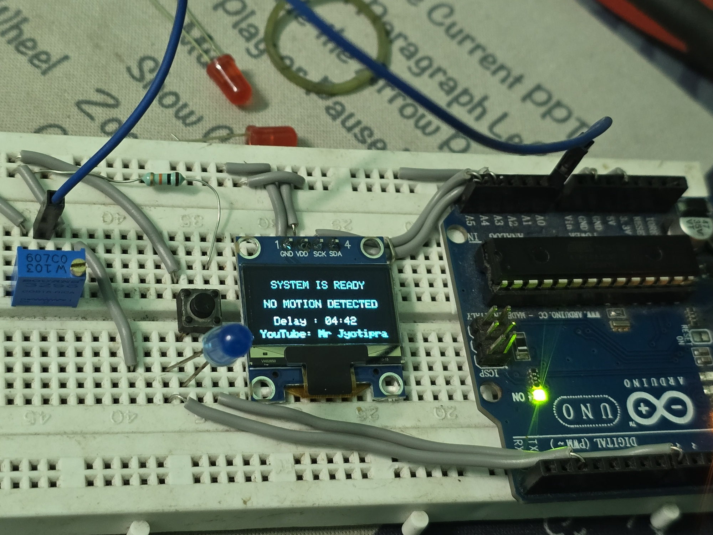
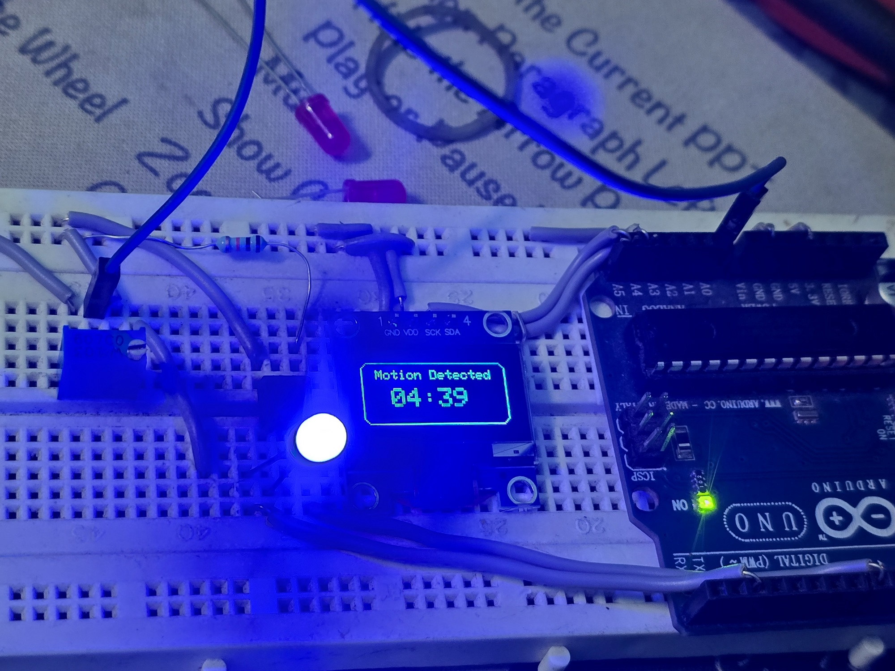
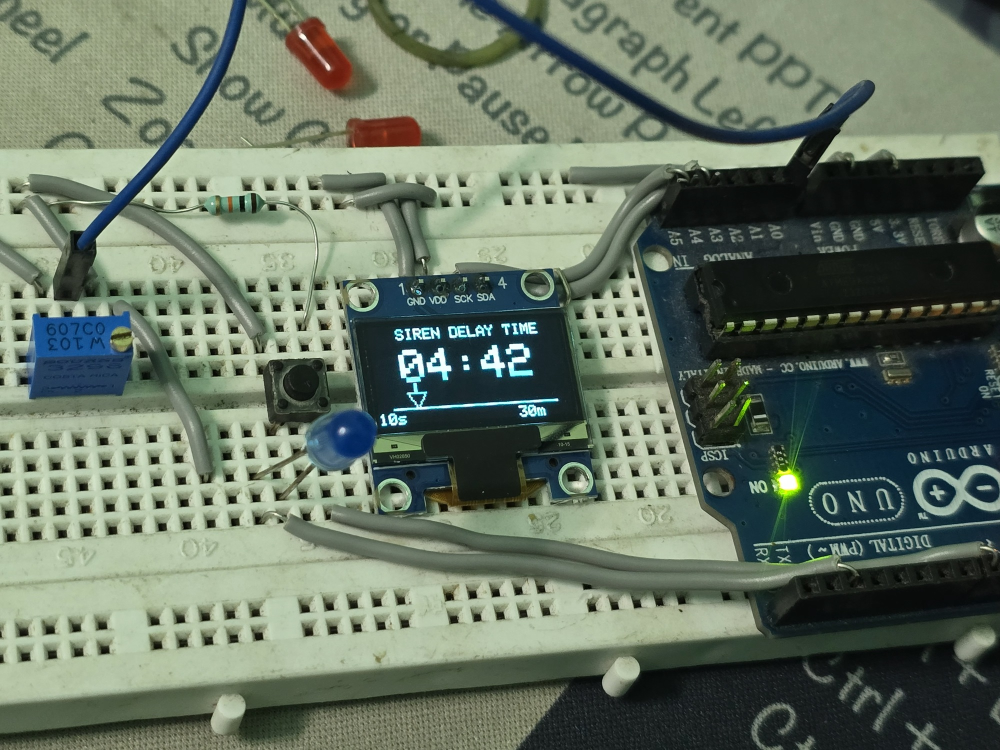

# 🚨 Laser Based Industrial Siren System

<p align="center">
  
</p>

<p align="center">


</p>

<p align="center">
  <b>Industrial Laser Triggered Smart Siren Controller with OLED Animated User Interface</b>
</p>

---

# 📑 Table of Contents

- [📖 Introduction](#-introduction)
- [✨ Features](#-features)
- [🛠 Hardware Used](#-hardware-used)
- [💻 Software Used](#-software-used)
- [🔌 Pin Configuration](#-pin-configuration)
- [⚙ Working Principle](#-working-principle)
- [🎨 OLED User Interface](#-oled-user-interface)
- [🎬 Demo Videos](#-demo-videos)
- [🖼 Project Images](#-project-images)
- [📂 Project Structure](#-project-structure)
- [📥 Clone This Repository](#-clone-this-repository)
- [🏭 Applications](#-applications)
- [🚀 Future Improvements](#-future-improvements)
- [📜 License](#-license)
- [👨‍💻 Developed By](#-developed-by)

---

# 📖 Introduction

The **Laser Based Industrial Siren System** is a professional embedded industrial safety and automation project developed using Arduino and SSD1306 OLED display technology.

The system is designed to detect motion or laser interruption events and activate an industrial siren after a configurable delay period. The delay duration can be adjusted in real-time using an analog controller.

A modern OLED graphical interface provides:

- Real-time siren delay visualization
- Motion detection popup
- Animated countdown interface
- Full-screen delay adjustment UI
- Industrial dashboard-style display

This project is ideal for:

- Industrial automation
- Factory safety systems
- Restricted area monitoring
- Smart laser security barriers
- Warehouse protection systems

---

# ✨ Features

- 🎨 OLED Animated Interface
- ⏱ Adjustable Siren Delay Timer
- 🚨 Laser Trigger Detection
- 📟 Countdown Popup Screen
- 🎛 Analog Delay Control
- 🚀 Boot Animation
- 🏭 Industrial UI Design
- 📉 Smooth Analog Filtering
- ⚡ Stable Countdown System
- 🖥 Full Screen Delay Adjustment Popup
- 🔊 Automatic Siren Release
- 🧠 Embedded OOP Programming Architecture

---

# 🛠 Hardware Used

| Component | Description |
|---|---|
| Arduino UNO/Nano | Main controller |
| SSD1306 OLED Display | UI display |
| Laser Module | Trigger source |
| LDR / Receiver | Laser detection |
| Push Button | Manual trigger |
| Potentiometer | Delay adjustment |
| Relay Module | Siren control |
| Amplifier/Siren | Alarm output |
| Power Supply | System power |

---

# 💻 Software Used

| Software | Purpose |
|---|---|
| Arduino IDE | Firmware development |
| Adafruit GFX Library | Graphics rendering |
| Adafruit SSD1306 Library | OLED display driver |
| Git | Version control |
| GitHub | Project hosting |

---

# 🔌 Pin Configuration

| Device | Arduino Pin |
|---|---|
| OLED SDA | A4 |
| OLED SCL | A5 |
| Trigger Input | D8 |
| Siren Output | D2 |
| Analog Delay Input | A0 |

---

# ⚙ Working Principle

1. System powers ON
2. Boot animation starts
3. OLED enters standby mode
4. User adjusts siren delay using potentiometer
5. OLED displays selected delay time
6. Laser interruption triggers countdown
7. Siren output activates
8. Countdown popup appears
9. Countdown decreases in real-time
10. Siren output releases automatically after timer completion

---

# 🎨 OLED User Interface

## 🏠 Normal Screen

Displays:
- System Ready Status
- Motion Detection Status
- Current Siren Delay Time
- Sliding Website Branding

---

## ⏱ Delay Adjustment Popup

Automatically appears when analog delay value changes:

- Full-screen popup interface
- Large countdown timer
- Animated slider
- Real-time delay preview

---

## 🚨 Countdown Popup

During trigger event:

- Motion Detected popup
- Live decreasing countdown
- Siren active indication

---

# 🎬 Demo Videos

## 🚀 Boot Animation

[](Prototype/Video/boot.mp4)

---

## ⚙ Programming & UI Demo

[](Prototype/Video/prograaming.mp4)

---

## 🚨 Trigger Detection Demo

[](Prototype/Video/trigger.mp4)

---

# 🖼 Project Images

## 🚀 Boot Screen


---

## 🏠 Home Screen


---

## ⏱ Siren Delay Adjustment



---

## 🚨 Trigger Detection Popup


---

# 📂 Project Structure

```text
Laser-Based-Industrial-Siren-System
│
├── main.ino
├── DisplayManager.h
├── boot.h
├── README.md
├── LICENSE
│
├── Prototype
│   ├── Images
│   │   ├── boot.jpg
│   │   ├── home_Screen.jpg
│   │   ├── Siren_Delay_Time.jpg
│   │   └── triggred.jpg
│   │
│   └── Video
│       ├── boot.mp4
│       ├── prograaming.mp4
│       └── trigger.mp4
│
├── PCB
│   ├── 3PCB_Laser_Activated_Industrial_Siren.pdf
│   └── compressed.mp4
│
├── Schematics
│   ├── Laser_Activated_Industrial_Siren.png
│   └── Circuit_Screenshot.png
│
└── Final_Design
    └── coming_soon.txt
```

---

# 📥 Clone This Repository

```bash
git clone https://github.com/YOUR_USERNAME/Laser-Based-Industrial-Siren-System.git
```

---

# 🏭 Applications

- Industrial Safety Systems
- Smart Factory Automation
- Laser Security Barrier
- Restricted Area Monitoring
- Warehouse Safety System
- Intrusion Detection System
- Industrial Alarm Controller
- Staircase Siren System

---

# 🚀 Future Improvements

- RTC Integration
- WiFi Monitoring
- GSM Alert System
- IoT Dashboard
- EEPROM Settings Storage
- Multi-zone Trigger System
- Industrial Relay Expansion

---

# 📜 License

This project is licensed under the MIT License.

---

# 👨‍💻 Developed By

## Mr Jyotiprasad

Embedded Systems Developer  
Industrial Automation & Safety Systems  
Arduino • IoT • Embedded UI Design • Industrial Electronics

<p align="center">
  ⭐ If you like this project, give it a star on GitHub ⭐
</p>
